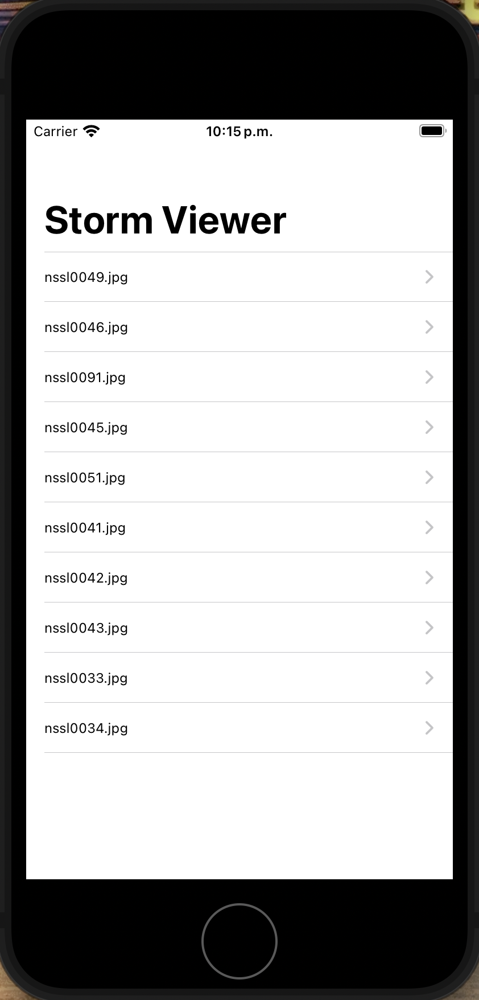
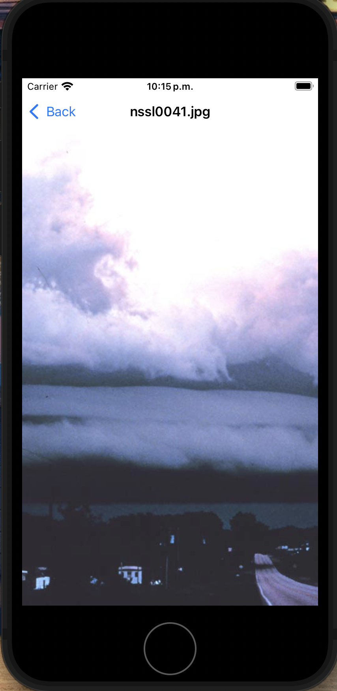

# Storm Simple View

This is simple table to show some storm images using UIKit

## Features

- Convert between multiple currencies
- Real-time exchange rate updates
- Store and retrieve past conversions using User Defaults
- User-friendly interface with SwiftUI

## Tech Stack

- UIKit
- UINavigationController
- UITableViewController

## Requirements
- Xcode 12.0 or later
- iOS 14.0 or later
## Contributing

Contributions are always welcome!

We welcome contributions! Please fork the repository and submit pull requests.

